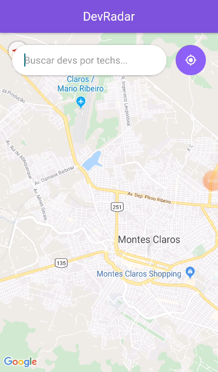
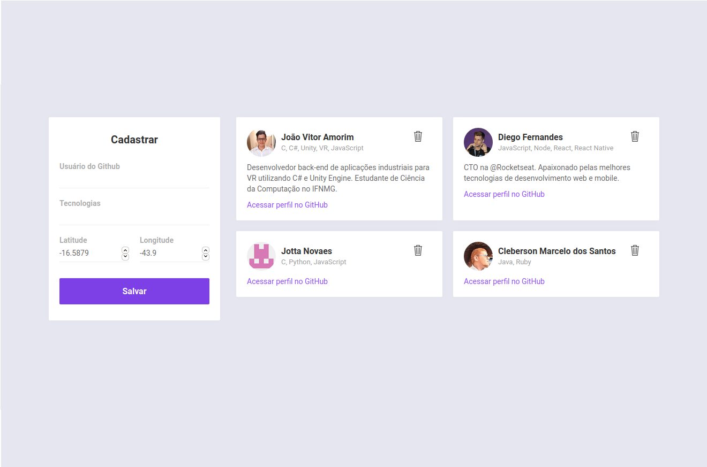

<h1 align="center">
    
</h1>

<p align="center">
  

  
  
  <a href="https://github.com/JV-Amorim/DevRadar_OmniStack/commits/master">
    
  </a>

  
</p>

<p align="center">
  <a href="#devradar">DevRadar</a>&nbsp;&nbsp;&nbsp;|&nbsp;&nbsp;&nbsp;
  <a href="#tecnologias">Tecnologias</a>&nbsp;&nbsp;&nbsp;|&nbsp;&nbsp;&nbsp;
  <a href="#instruções">Instruções</a>&nbsp;&nbsp;&nbsp;|&nbsp;&nbsp;&nbsp;
  <a href="#licença">Licença</a>
</p>

<br>

<p align="center">
  
  
</p>

## DevRadar

O DevRadar trata-se de uma aplicação que exibe em um mapa, com base na geolocalização do usuário, desenvolvedores próximos que trabalham com a tecnologia pesquisada. Trata-se de uma demonstração do poder da OmniStack (Node + React + React Native), stack totalmente em JavaScript. A aplicação foi desenvolvida na Semana OmniStack 10, realizada pela Rocketseat.

## Tecnologias

Abaixo são listadas as tecnologias utilizadas no desenvolvimento do DevRadar:

- [Node.js;](https://nodejs.org/en/)
- [React;](https://reactjs.org)
- [React Native;](https://facebook.github.io/react-native/)
- [Expo.](https://expo.io/)

## Instruções

### Pré-requisitos
Antes de começar a rodar o projeto no seu computador ou smartphone, é necessário que realize os seguintes items:
- [Instalar o Node.js;](https://nodejs.org/en/download/)
- [Instalar o Yarn;](https://legacy.yarnpkg.com/lang/pt-br/docs/install/)
- [Criar um cluster gratuito no MongoDB.](https://www.mongodb.com/)

### Instalação - Backend
Configure o MongoDB e atualize a string de conexão, fornecida nas configurações de conexão do seu cluster, com seu `User:Senha` no arquivo `index.js`.
Para instalar as dependências e executar o servidor (modo desenvolvimento), clone o projeto em seu computador e em seguida execute:
```bash
cd backend
yarn install
yarn dev
```

### Instalação - Web
Para iniciar o **Web** do React utilize os comandos:
```bash
cd frontend
yarn install
yarn start
```
Assim que o processo terminar, automaticamente será aberta no seu navegador a página `localhost:3000` contendo o projeto web.

### Mobile
Para ver a aplicação mobile com o React Native primeiro é necessário colocar o IP do seu servidor (ou computador) no arquivo `src/services/api.js`, e depois executar os comandos:
```bash
# NÃO é preciso executar a linha de baixo caso ja tenha o Expo (CLI) instalado
yarn global add install expo-cli
cd mobile
yarn install
yarn start
```
Assim que o processo terminar, automaticamente será aberta no seu navegador a página `localhost:19002`. Conecte seu emulador, ou teste o aplicativo por `LAN`: baixe o aplicativo *Expo* da Play Store ou App Store e em seguida escaneie o código QR.

### Insomnia 
Para testar a API do DevRadar, baixe e instale o [Insomnia](https://insomnia.rest/download/) e em seguida clique na Workspace → `Import/Export` → `Import Data` → `From File` → e selecione o arquivo ` 	insomnia_export.json` deste repositório.

## Licença

Esse projeto é licenciado pela MIT License. Veja a página da [licença](https://opensource.org/licenses/MIT) para detalhes.
